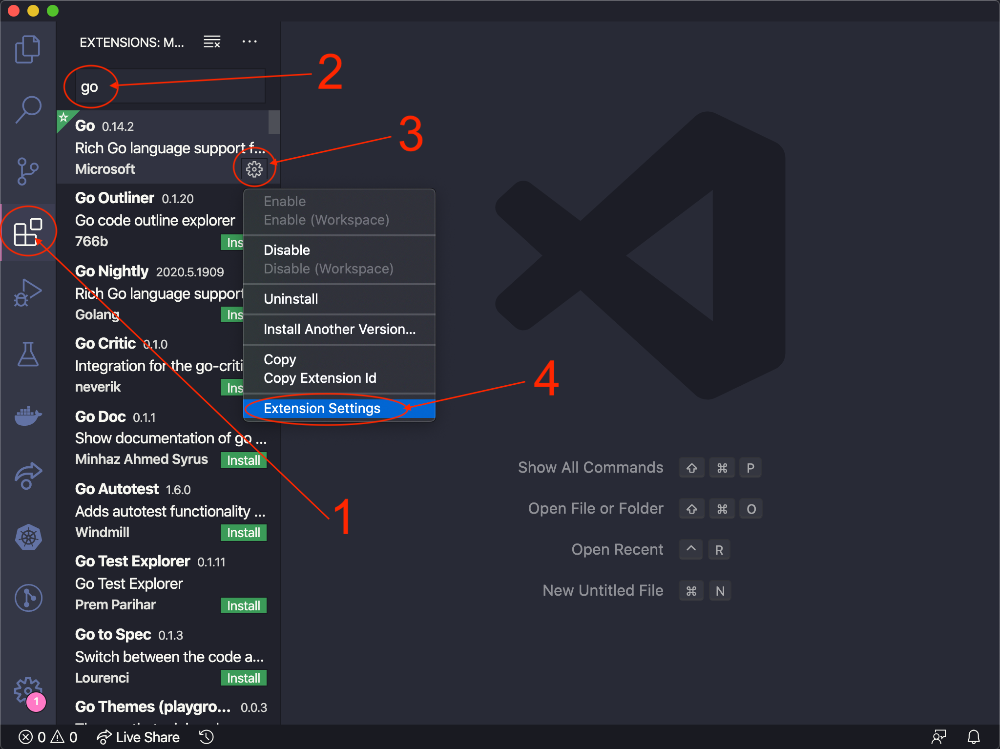
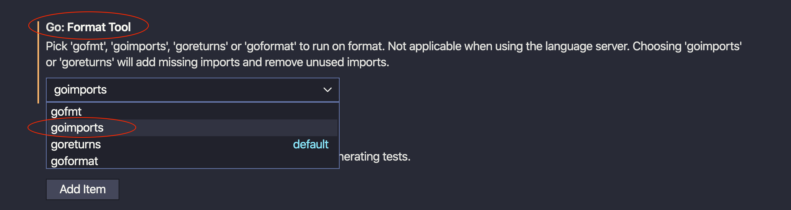

# Lab 0 - Install the Prerequisites

## 1. Golang Installation

> This workshop has been created using `go version go1.14.6 darwin/amd64`

### macOS

To manually install the Go tools, use the official [Go documentation](https://golang.org/doc/install) and follow the instructions.

or

If you choose to use `brew`, follow this short [installation guide](https://quii.gitbook.io/learn-go-with-tests/go-fundamentals/install-go)
up to the heading "Go Modules". You only need to complete the first.  

### Windows

To manually install the Go tools, use the official [Go documentation](https://golang.org/doc/install) and follow the instructions.

> **Note**: A quick Windows setup guide can be found [here](https://www.geeksforgeeks.org/how-to-install-go-on-windows/)

### Ubuntu 16.04+
The following `wget` command makes use of [this open source repository](https://github.com/canha/golang-tools-install-script) to install Golang onto your machine and configure the environment.

```bash
wget -q -O - https://raw.githubusercontent.com/canha/golang-tools-install-script/master/goinstall.sh \
| bash -s -- --version 1.14.6
```

or

Follow this [quick installation](https://medium.com/better-programming/install-go-1-11-on-ubuntu-18-04-16-04-lts-8c098c503c5f) guide. Making sure you change `1.11` -> `1.14.x` (This should also work on Ubuntu 20.04)

### Check your version

In your terminal, check your go version by using the following command

```bash
go version
```

The output for this will will depend upon your system but we just care about the command running / showing the correct version. You should get the following output (or similar):

```bash
go version go1.14.6 darwin/amd64
```

Once Go is installed via which ever method you have chosen, it is **important** to ensure your system follows the folder tree shown below:

```bash
.
├── $HOME
│    ├── /<user>
│         ├── /go
│              ├── /bin
│              ├── /pkg
│              └── /src
│                   └── /github.com
```

If you are using a Windows machine and have installed Golang by using the `gox.x.x.windows-amd64.msi` official executable, you may have extra files in the directories. Just ensure the paths above also exist.

---

## 2. IBM Cloud account registration

Login or create an [IBM Cloud](http://ibm.biz/golang_web) account

---

## 3. IBM Cloud & Cloud Foundry command-line interface installation

1. Install the [IBM Cloud command-line interface from this link](https://cloud.ibm.com/docs/cli?topic=cloud-cli-install-ibmcloud-cli).

   Once installed, you can access IBM Cloud from your command-line with the prefix `ibmcloud`.

2. Log in to the IBM Cloud CLI: `ibmcloud login`.
3. Enter your IBM Cloud credentials when prompted.

> **Note**: If you have a federated ID, use `ibmcloud login --sso` to log in to the IBM Cloud CLI. Enter your user name, and use the provided URL in your CLI output to retrieve your one-time passcode. You know you have a federated ID when the login fails without the `--sso` and succeeds with the `--sso` option.

4. Install the IBM Cloud Foundry command-line interface with the command `ibmcloud cf install`

---

## 4. IDE

[Visual Studio Code](https://code.visualstudio.com/) with the recommended [Go extension](https://code.visualstudio.com/docs/languages/go). When you begin to code Go inside VSCode you may be prompted to install a bunch of extensions. These are good and will help make development much easier!

If you are using this option, to make development easier a suggestion is to amend the imports setting on the extension once you have installed it. This will help delete unused imports and add them in when needed, resulting in less ambiguous errors. To do this follow the 2 quick steps below:



Scroll down until you find the `Go: Format Tool` options (its in alphabetical order)



OR

[Jet Brains GoLand](https://www.jetbrains.com/go/download/#section=mac) (GoLand isn't free but it does have a 30 day free trial)

---

## 5. GitHub account + git installation

1. Visit [GitHub](https://github.com/login) to create an account
2. To install `git` follow the [instructions](https://git-scm.com/book/en/v2/Getting-Started-Installing-Git) on the official `git` documentation.

Once you are all set up you can move straight on to [Lab 1](./lab-1.md)
