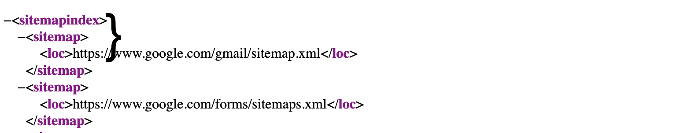

# Lab 5 - Crawl the web :bug:

In this lab you are going to write a function to crawl a web page for its embedded URLs using its sitemap. Web crawling will follow any embedded links on a web page until it reaches a page where no more leading URLs are present. In this instance you will be doing a very simple crawl of the google.com sitemap.

By visiting `https://www.google.com/sitemap.xml` you will see the site map index. This outlines all of the URL's present on this webpage.

The code below is going to visit this page and then use the XML to capture the URL's. You will notice the code specifies `"//sitemapindex/sitemap/loc"` as its target element. This is where the URL is stored within the XML. Refer to the image below to see this.



### Step 1

1. Navigate to the `/pkg/actions/crawl.go` file
2. In this file, add the code below (read the code carefully, so you understand what is happening)

```golang

package actions

import (
	"fmt"
	"github.com/gocolly/colly"
	"net/http"
	"strconv"
	"strings"
)

func Crawl(w http.ResponseWriter, r *http.Request) {

	// Array containing all the known URLs in a sitemap
	var knownUrls []string

	// Create a Collector specifically for Google using a whitelist for the domain
	c := colly.NewCollector(colly.AllowedDomains("www.google.com"))

	// Create a callback on the XPath query searching for the URLs in the sitemap
	c.OnXML("//sitemapindex/sitemap/loc", func(e *colly.XMLElement) {
		knownUrls = append(knownUrls, e.Text)
	})

	// Start the collecting job at the following URL
	c.Visit("https://www.google.com/sitemap.xml")

	numURLs := strconv.Itoa(len(knownUrls))

	// Push URL found to the slice
	knownUrls = append(knownUrls, "Collected "+numURLs+" URLs")

	urlStr := strings.Join(knownUrls, "\n")

	// Write the response to the byte array - Sprintf formats and returns a string without printing it anywhere
	w.Write([]byte(fmt.Sprintf(urlStr)))
}

```

> **Note**: You will notice the import `"github.com/gocolly/colly"`. This is a 3rd party import that has been written to make web scraping much easier.

### Step 2

Now the code is written, you need to add a function call into a route handler on the sever.

Just like you did in the previous Lab, [Lab 4](./lab-4.md), you need to create a `http.HandleFunc()` in your `main()` function.

Below the line `http.HandleFunc("/scrape", actions.Scrape)` in your `main()` function in `main.go`, add the line, `http.HandleFunc("/crawl", actions.Crawl)`. Make sure the import for the actions package is also visible, this allows the code to be accessible from the `main.go` file. If it is not, in the `import` block  add `"github.com/golang-web-scraping/pkg/actions"` (make sure the system path is correct for your project).

This route handler will call the `Crawl()` function when the route `/crawl` is hit and print out the results to the screen.

### Step 3

Just like before, push the application code up to the cloud again...

1. Ensure all the project code is saved.
2. Ensure you are still signed in to your `ibmcloud` account from the terminal. If your are not logged in, follow the login instructions on [Lab 3](./lab-3.md) step 3.
2. In your terminal, make sure you are in the root directory of your project and enter the command `ibmcloud cf push`. This will push the new code up to the project you already have running in `ibmcloud`.
3. In the URL address bar of a web browser, enter the project address which can be found in the terminal output once the app has started. It will be the value of `routes`. This will show you the home route of the sever.
4. Append `/crawl` to the end of the URL to see the output of the web crawling function.
5. You should see the number of active embedded links taken from the `google.com` site map.

[Conclusion](./conclusion.md)